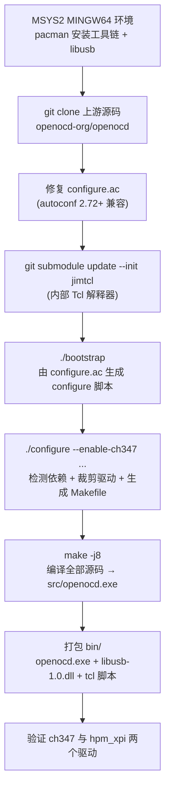

# WCH-LinkE(CH347)高速 JTAG 烧录 HPM5E31 —— 四个 OpenOCD 对比与完整处理过程

> 目的:使用 WCH-LinkE(CH347,高速 JTAG 模式)通过 OpenOCD 烧录 HPMicro HPM5E31(Andes RISC-V 内核)的 XPI NOR Flash。
> 本文档记录了排查全过程,并对比了四个 OpenOCD 版本的能力,供 WCH 论坛咨询使用。

---

## 1. 硬件 / 软件环境

| 项目 | 说明 |
|---|---|
| 目标板 | HPMicro HPM5E31(自研板 `hpm5e31_LuckyCAT`) |
| CPU | Andes RISC-V 内核,JTAG TAP ID `0x1000563d`(IR length = 5) |
| Flash | 板载 SPI NOR(XPI 控制器),基址 `0x80000000`,大小 1MB |
| 调试器 | **WCH-LinkE 高速 JTAG 模式(基于 CH347 芯片)** |
| CH347 枚举 | VID `0x1a86` / PID `0x55dd`(mode 3 = UART+JTAG) |
| CH347 接口 | MI_00 = 串口(COM7,usbser);MI_02 = JTAG/I2C/SPI(驱动 `CH341_A64`,WCH 私有驱动) |
| HPM SDK | `C:/TOOLs/sdk_env_v1.12.1`(hpm_sdk 1.12.1) |
| 编译工具链 | `rv32imac_zicsr_zifencei_multilib_b_ext-win` |
| 固件 | `demo/4_ethercat_io`(EtherCAT IO 例程,ELF 约 112KB) |

---

## 2. 四个 OpenOCD 一览

> 表格为最终实测结论(WinUSB 驱动状态下)。

| # | OpenOCD 版本 | 来源 | ch347 驱动 | hpm_xpi 驱动 | WCH 驱动下连 CH347 | WinUSB 下连 CH347 | 能烧 HPM5E31 |
|---|---|---|---|---|---|---|---|
| A | `0.12.0+dev-00003-g02cebd827`(2026-05-25) | HPMicro sdk_env 自带 | ❌ | ✅ | — | —(无 ch347 驱动) | ✅(配 J-Link,已实测) |
| B | xPack `0.12.0+dev-02228-ge5888bda3`(2025-10-04) | xPack 官方 release 0.12.0-7 | ✅ | ❌ | 需 WinUSB | ✅ **实测连上** | ❌ |
| C | `0.12.0+dev-snapshot`(2026-08-15) | 上游 master 自行编译(见 5.5) | ✅ | ✅ | 需 WinUSB | ✅ **实测连上** | ✅ **实测烧录成功** |
| D | WCH/MounRiver `0.11.0+dev-snapshot`(2026-07-23) | MounRiver Studio 2 自带 | ✅ | ❌ | ✅ **实测免驱动连上** | ❌ **实测失败**(IoCHubDLL 需 WCH 驱动) | ❌ |

> 结论:**最终可用方案 = 自编译上游 OpenOCD(C)+ WinUSB 驱动**,已实测完整烧录成功(`** Verified OK **`)。
>
> 另一个关键发现:WCH 版 OpenOCD(D)的 `IoCHubDLL` 通信依赖 WCH 私有驱动(`CH341_A64`),**与 WinUSB 互斥** —— 一旦换成 WinUSB,D 反而连不上(`Error: CH347 Open Error`)。

---

## 3. 详细对比

### A. HPMicro sdk_env 自带 OpenOCD

- 路径:`C:/TOOLs/sdk_env_v1.12.1/tools/openocd/openocd.exe`
- 适配器驱动列表(`adapter list`):`dummy, ftdi, usb_blaster, esp_usb_jtag, jtag_vpi, vdebug, jtag_dpi, ft232r, amt_jtagaccel, usbprog, jlink, vsllink, rlink, ulink, angie, arm-jtag-ew, remote_bitbang, hla, osbdm, opendous, cmsis-dap, kitprog, xds110, st-link`
- **没有 ch347**。执行 `adapter driver ch347` 报错:

  ```
  Error: The specified adapter driver was not found (ch347)
  ```

- **有 hpm_xpi**(用 J-Link 烧录 HPM5E31 时 `flash bank ... hpm_xpi ...` 正常,`** Verified OK **`)。
- 因此:**这个版本无法与 CH347 通信**(Zadig 换 USB 驱动也无济于事——驱动代码根本没编译进去)。

### B. xPack OpenOCD 0.12.0-7

- 路径:`C:\Users\he\Downloads\openocd-latest\xpack-openocd-0.12.0-7\bin\openocd.exe`
- **有 ch347**。`adapter driver ch347` 通过。
- **没有 hpm_xpi**。执行 `flash bank ... hpm_xpi ...` 报错:

  ```
  Error: flash driver 'hpm_xpi' not found
  ```

- 用 ch347 连接 CH347 时报错(需要 WinUSB 驱动,见 4.5.11):

  ```
  Error: libusb_open() failed with LIBUSB_ERROR_NOT_FOUND
  Error: CH347 not found. Tried VID/PID pairs: 1a86:55dd
  ```

### C. 上游 master 自行编译的 OpenOCD(本文作者编译)

- 路径:`...\WCHLinkExHPM\bin\openocd.exe`
- **ch347 ✅ + hpm_xpi ✅ 两者兼备**(上游 openocd-org/openocd master 已同时包含 `src/jtag/drivers/ch347.c` 与 `src/flash/nor/hpm_xpi.c`)。
- 编译过程与踩坑见 **4.5**。
- 连接 CH347 同样报 `libusb_open() failed with LIBUSB_ERROR_NOT_FOUND`(需要 WinUSB)。

### D. WCH / MounRiver Studio 2 自带 OpenOCD

- 路径:`C:\MounRiver\MounRiver_Studio2\resources\app\resources\win32\components\WCH\OpenOCD\OpenOCD\bin\openocd.exe`
- 适配器:`jlink, cmsis-dap, ch347`。
- **有 ch347**,且用的是 WCH 自家语法 `ch347 vid_pid 0x1a86 0x55dd`(文档《WCH-Link 使用说明》7.4 节的写法)。
- 目录内自带 `IoCHubDLL.dll`(WCH 的 CH347 通信库)、`libusb0.dll`、`libusb-1.0.dll`、`libhidapi-0.dll`、`libjaylink-0.dll`。
- **实测可在不改 Windows USB 驱动的情况下直接打开 CH347 并识别 HPM5E31**:

  ```
  Info : CH347 Open Succ.
  Info : clock speed 10000 kHz
  Info : JTAG tap: auto0.tap tap/device found: 0x1000563d (mfg: 0x31e (Andes Technology Corporation), part: 0x0005, ver: 0x1)
  ```

- **但没有 hpm_xpi**(二进制中搜索 `hpm_xpi` 为 0 处;其自带 flash 驱动为 `wch_riscv` / `gd32vf103` 等 WCH 芯片专用),因此**无法直接烧写 HPM5E31 的 XPI NOR Flash**。

### 3.5 四个 OpenOCD 的来源详解

| # | 来源 | 本质 | 如何获取 |
|---|---|---|---|
| A | **HPMicro sdk_env 官方开发环境** | HPMicro 基于上游 OpenOCD 的 fork/定制构建,额外编译了 HPM 自有驱动(`hpm_xpi`、`hpm_xpi_hybrid` 等)与 SoC 脚本(`hpm_common.cfg`、`hpm_reset.cfg`) | 随 sdk_env 安装包安装,路径 `C:\TOOLs\sdk_env_v1.12.1\tools\openocd\`;官网 www.hpmicro.com 下载,源码见 GitHub `hpmicro/OpenOCD` |
| B | **xPack 官方 Release** | 独立的通用 OpenOCD 构建(基于上游 0.12.0+dev-02228 快照),与厂商无关,驱动较全 | GitHub `xpack-dev-tools/openocd-xpack` 的 `v0.12.0-7`(2025-10-05),下载 `xpack-openocd-0.12.0-7-win32-x64.zip` |
| C | **上游官方仓库自行编译** | openocd-org/openocd 的 master 分支(2026-08-15 快照,commit `da3920b`),按 4.5 节流程在 Windows/MSYS2 编译 | `git clone https://github.com/openocd-org/openocd.git`(任何人可复现) |
| D | **WCH 官方 IDE「MounRiver Studio 2」内置组件** | WCH 基于上游 OpenOCD 的 fork,加入 WCH 专用驱动(`ch347` 走 `IoCHubDLL`、`wlinke`/`wch_riscv` 等)与 WCH 芯片 flash 算法 | 安装 MounRiver Studio 2(官网 www.mounriver.com),组件位于 `...\resources\app\resources\win32\components\WCH\OpenOCD\OpenOCD\bin\` |

**版本对应关系**:

| # | 版本字符串 | 构建时间 | 备注 |
|---|---|---|---|
| A | `0.12.0+dev-00003-g02cebd827` | 2026-05-25 | HPMicro 定制 |
| B | `0.12.0+dev-02228-ge5888bda3-dirty` | 2025-10-04 | xPack 打包上游快照 |
| C | `0.12.0+dev-snapshot` | 2026-08-15 | 上游 master 最新 |
| D | `0.11.0+dev-snapshot` | 2026-07-23 | WCH fork |

**来源差异带来的驱动差异**:
- A、D 都是「厂商 fork」:A 面向 HPM(有 `hpm_xpi`),D 面向 WCH(有 `ch347`/`wch_riscv`),各自只关心自家芯片 → 两个驱动互相缺失。
- B、C 都来自「上游」:B 快照较旧,ch347 还是 WCH 式语法、且 `hpm_xpi` 尚未合入;最新的 C 同时包含两者(上游 master 已有 `src/jtag/drivers/ch347.c` 与 `src/flash/nor/hpm_xpi.c`)。

---

## 4. 完整处理过程

### 4.1 工程本身的编译问题(与 OpenOCD 无关,但属于前置)

1. `make flash` 报 `does not appear to contain CMakeLists.txt`:
   - 原因:本 demo 的 `CMakeLists.txt` 在 `ecat_io/` 子目录,Makfile 的 `-S .` 找不到。
   - 修复:新增 `SRC_DIR ?= ecat_io`。
2. CMake 报 `since HPM_BUILD_TYPE is given, only "debug" or "release" is allowed for CMAKE_BUILD_TYPE`:
   - 原因:SDK 1.12.1 约定用 `-DHPM_BUILD_TYPE=flash_xip`,而不是 `-DCMAKE_BUILD_TYPE`。
   - 修复:改传 `-DHPM_BUILD_TYPE`。
3. 编译报 `'e2p_t' has no member named 'nor_config'` / `'E2P_FLUSH_BEGIN' undeclared`:
   - 原因:demo 的 `port/hpm_ecat_e2p_emulation.c` 是按旧版 SDK 写的,与 SDK 1.12.1 的 `eeprom_emulation` 组件 API 不兼容。
   - 修复:按 SDK 自带参考实现 `samples/ethercat/port/` 改写(分离 `nor_flash_config_t` 与 `e2p_t`,`E2P_FLUSH_BEGIN`→`E2P_FLUSH_FORCE`)。
4. 运行时 `[E2P ERROR] info table overflow, max=100`:
   - 原因:SDK 1.12.1 的宏名是 `E2P_MAX_VAR_CNT`(默认 100),demo 里写的是旧宏名 `EEPROM_MAX_VAR_CNT`(2048),没生效;而初始化要写入 1024 个 EEPROM 条目。
   - 修复:`user_config.h` 补定义 `E2P_MAX_VAR_CNT (ESC_EEPROM_SIZE)`。

> 以上修复后,用 J-Link 烧录**已成功**(`** Verified OK **`)。之后切换调试器到 WCH-LinkE。

### 4.2 切换到 WCH-LinkE(CH347)高速 JTAG 模式

- 用户文档《WCH-Link 使用说明》7.4 节给出的 CH347 配置写法:

  ```
  adapter driver ch347
  ch347 vid_pid 0x1a86 0x55dd
  adapter speed 10000
  ```

- 将 Makefile 的探针配置改为 CH347(`OPENOCD_CFG = build/wchlinke.cfg`)。

### 4.3 尝试 A:sdk_env OpenOCD —— 缺 ch347 驱动

- 报错 `Error: No J-Link device found`(配置仍指向 jlink.cfg 时的现象)。
- 确认驱动列表中没有 ch347 → **此版本与 CH347 无缘**。

### 4.4 尝试 B:xPack OpenOCD —— 有 ch347、缺 hpm_xpi

- ch347 驱动可用,但 `hpm_xpi` 不存在 → 能连探针也烧不了 HPM flash。

### 4.5 自行编译上游 OpenOCD(可复刻的完整流程)

> 目标:在 Windows 上编译出**同时支持 `ch347` 与 `hpm_xpi`** 的 OpenOCD。
> 实测产物:`0.12.0+dev-snapshot`,已用 CH347 + WinUSB 完整烧录 HPM5E31 成功(`** Verified OK **`)。

#### 4.5.0 先讲清楚:两个关键驱动是什么、从哪来

| | `ch347` | `hpm_xpi` |
|---|---|---|
| 类型 | **适配器驱动**(adapter driver,驱动探针) | **Flash 驱动**(flash driver,驱动烧录算法) |
| 作用 | 让 OpenOCD 认识并驱动「CH347 / WCH-LinkE 高速 JTAG」探针(USB↔JTAG 桥) | 让 OpenOCD 能烧写 HPMicro 芯片的 XPI NOR Flash(如 HPM5E31) |
| 源码位置 | 上游 `src/jtag/drivers/ch347.c` | 上游 `src/flash/nor/hpm_xpi.c` |
| 谁开发的 | 上游社区(WCH 相关贡献) | **HPMicro(先楫半导体)**,版权头 `Copyright (c) 2025 hpmicro` |
| 底层实现 | Windows 上经 **libusb-1.0** 访问 USB 设备(→ 需要 WinUSB 驱动) | 把预编译的 RISC-V 小程序载入芯片 RAM 的 work-area 运行,由它调用芯片 **BootROM 的 `rom_xpi_nor_*` API** 完成 Flash 擦写 |
| 配套资源 | 探针配置自写(`ch347.cfg`) | 上游自带 `contrib/loaders/flash/hpmicro/` 算法与 `tcl/board/hpmicro/hpm*.cfg` 板级脚本 |

**`hpm_xpi` 的来龙去脉(重点)**:

- 它是由 **HPMicro** 为其自家 HPM 系列 RISC-V MCU(HPM5300/6200/6300/6700/6800/6E00/5E00 等)开发的 XPI NOR Flash 烧写驱动,**2025 年贡献并合入上游 openocd-org/openocd master**。
- **烧写原理**:HPM 芯片 BootROM 内置 `rom_xpi_nor_*` 底层函数;`hpm_xpi` 驱动把一段**预编译好的 RISC-V 算法**(`contrib/loaders/flash/hpmicro/hpm_xpi_flash.inc`,源码 `hpm_xpi_flash.c/.S` 在同目录)通过 JTAG 加载进芯片 RAM,让算法替你调用这些 ROM 函数完成擦除/编程,数据由 OpenOCD 通过 RISC-V 调试接口(DMI/SBA)灌入 —— 有了它,OpenOCD 一条 `program xxx.elf verify reset exit` 就能自动完成整条烧写流水线。
- **为什么有的版本有、有的没有**:

  | OpenOCD | 是否含 hpm_xpi | 原因 |
  |---|---|---|
  | A. sdk_env(HPMicro 定制) | ✅ | HPMicro 自家产品 |
  | B. xPack 0.12.0-7(2025-10-05 快照) | ❌ | hpm_xpi 合入时间晚于该快照 |
  | C. 上游 master(2026-08-15 克隆) | ✅ | 已合入 |
  | D. WCH/MounRiver 版 | ❌ | 只面向 WCH 芯片,不含第三方 flash 算法 |

#### 4.5.1 整体流程一览



> 一句话理解:OpenOCD 是 C 写的跨平台程序,标准构建流程就是 **bootstrap(生成 configure)→ configure(按开关裁剪功能)→ make(编译链接)**,和绝大多数 GNU 软件一致。

#### 4.5.2 准备 MSYS2 编译环境

1. 下载安装 MSYS2:https://www.msys2.org/(Windows 下的 GNU 工具链环境)
2. 打开 **MSYS2 MINGW64** 终端(注意:不是 MSYS2 MSYS 终端),安装依赖:

   ```bash
   pacman -S --needed --noconfirm base-devel mingw-w64-x86_64-toolchain \
       mingw-w64-x86_64-libusb mingw-w64-x86_64-pkgconf \
       autoconf automake libtool
   ```

   - `mingw-w64-x86_64-toolchain`:`gcc` 等编译器(MINGW64 环境)
   - `mingw-w64-x86_64-libusb`:`ch347` 驱动依赖的 libusb-1.0 库(头文件 + DLL)
   - `mingw-w64-x86_64-pkgconf`:configure 检测依赖用
   - `autoconf/automake/libtool`:`bootstrap` 生成 configure 脚本用

3. 验证环境:

   ```bash
   export PATH=/mingw64/bin:/usr/bin:$PATH
   gcc --version
   pkg-config --exists libusb-1.0 && echo "libusb OK"
   ```

#### 4.5.3 获取源码

```bash
git clone --depth 1 https://github.com/openocd-org/openocd.git
cd openocd
```

> `--depth 1` 为浅克隆,只取最新 master 一个提交,加快下载;本仓库即包含 `ch347.c` 与 `hpm_xpi.c` 两个驱动源码。

#### 4.5.4 修复 configure.ac(autoconf 2.72+ 兼容性)

- **现象**:`./bootstrap` 报:

  ```
  configure.ac:778: error: '\' is already registered with AC_CONFIG_FILES.
  aclocal-1.18: error: autom4te failed with exit status: 1
  ```

- **原因**:新版 autoconf(2.72/2.73)不允许 `AC_CONFIG_FILES([...])` 列表内的反斜杠续行,而上游 `configure.ac` 恰好用了这种写法。
- **修改** `configure.ac`(去掉反斜杠):

  ```diff
   AC_CONFIG_FILES([
  -  Makefile \
  -  testing/Makefile \
  -  testing/tcl_commands/Makefile
  +  Makefile
  +  testing/Makefile
  +  testing/tcl_commands/Makefile
   ])
  ```

#### 4.5.5 拉取内部 jimtcl 子模块

```bash
git submodule update --init jimtcl
```

> OpenOCD 的 Tcl 命令解释器用的是 **jimtcl**(嵌入式 Tcl 实现)。MSYS2 仓库没有现成的 jimtcl 包,所以必须拉取 OpenOCD 自带的 submodule,并在 configure 时用 `--enable-internal-jimtcl` 让它使用这个内部版本。

#### 4.5.6 生成 configure 并配置

```bash
./bootstrap
./configure --enable-ch347 --enable-internal-jimtcl --disable-werror \
    --disable-buspirate --disable-vsllink --disable-rlink --disable-arm-jtag-ew \
    --disable-openjtag --disable-parport --disable-amtjtagaccel --disable-gw16012
```

- **`./bootstrap`**:由 `configure.ac` + `Makefile.am` 自动生成 `configure` 脚本和模板(执行一次即可)。
- **`./configure` 做什么**:检测环境(libusb 等)、根据 `--enable-*`/`--disable-*` 开关决定编译哪些驱动、最终生成 `Makefile`。
- **为什么 `--enable-ch347`**:必须显式开启 ch347 驱动(否则即使 libusb 在也可能不编)。
- **为什么 `--disable-*`**:`buspirate/vsllink/rlink/arm-jtag-ew/openjtag` 依赖 `termios.h`(Windows 没有),`parport/amtjtagaccel/gw16012` 依赖并行口 —— 这些在 Windows/MinGW 下**编译不过**,本项目也用不到,直接关掉。
- **确认配置成功**:摘要里应包含 `CH347 based devices ... yes`,且无 `configure: error`。

#### 4.5.7 编译

```bash
make -j8
```

- `-j8`:8 线程并行编译,加快速度。
- 产物:`src/openocd.exe`(约 18MB)。
- 末尾若出现 `git: 未找到命令`,只是 OpenOCD 想用 git 打版本号失败,属无害警告,不影响产物。

#### 4.5.8 打包为独立可执行(不依赖 MSYS2)

```bash
mkdir -p bin
cp src/openocd.exe bin/
cp /mingw64/bin/libusb-1.0.dll bin/   # 唯一外部 DLL(仅依赖系统 DLL)
cp -r tcl bin/tcl                     # OpenOCD 脚本(interface/board/target 等)
```

> 刚编译出的 `openocd.exe` 运行时需要 mingw64 的 DLL(尤其是 `libusb-1.0.dll`),把它们复制到 exe 同目录即可独立运行,不再依赖 MSYS2 环境变量。`tcl/` 目录是 OpenOCD 的脚本,`[find ...]` 会用到。

- 独立运行验证(无需 MSYS2 环境变量):

  ```
  bin\openocd.exe -c "adapter driver ch347" -c "shutdown"
  ```

#### 4.5.9 验证两个关键驱动

```bash
# ① ch347 适配器驱动(不报 not found 即通过)
bin/openocd.exe -c "adapter driver ch347" -c "exit"

# ② hpm_xpi flash 驱动(报 "target not defined" 即说明驱动已编译进去,
#    报 "flash driver not found" 才是没编进去)
bin/openocd.exe -c "flash bank xpi0 hpm_xpi 0x80000000 0x2000000 1 1 cpu0 0xF3000000 0x5 0x1000" -c "exit"

# ③ 二进制中是否含 hpm_xpi(粗略判断)
grep -c "hpm_xpi" bin/openocd.exe   # 应有 >0
```

#### 4.5.10 CH347 探针配置(上游版语法)

```tcl
# ch347.cfg
adapter driver ch347
adapter usb vid_pid 0x1a86 0x55dd   ; 上游标准语法(注意:不是 WCH fork 的 ch347 vid_pid)
transport select jtag
adapter speed 10000
reset_config none                    ; CH347 为 4 线 JTAG,无 SRST,复位靠 RISC-V 调试模块
```

#### 4.5.11 后续连接遇到的问题与解决(WinUSB)

- 连接 CH347 报:

  ```
  Error: libusb_open() failed with LIBUSB_ERROR_NOT_FOUND
  Error: CH347 not found. Tried VID/PID pairs: 1a86:55dd
  ```

  **原因**:`ch347` 驱动通过 libusb-1.0 访问设备,而 Windows 上 libusb 只能打开绑定 **WinUSB/libusbK** 驱动的设备;CH347 的 JTAG 接口(MI_02)默认绑定 WCH 私有驱动 `CH341_A64`。

  **解决**:用 **Zadig** 把该接口(MI_02)驱动换成 WinUSB(只影响 JTAG 接口,COM7 串口不受影响,可逆)。

  - Zadig 位置(sdk_env 自带):`C:\TOOLs\sdk_env_v1.12.1\tools\zadig\zadig.exe`
  - 步骤:Options → List All Devices → 选择 `USB HighSpeed-JTAG/I2C... CH347`(驱动显示 `CH341_A64`)→ 目标驱动选 WinUSB → Replace Driver

### 4.6 尝试 D:WCH / MounRiver OpenOCD —— 免驱动直连成功,但缺 hpm_xpi

- 在**不修改任何 USB 驱动**的情况下:

  ```
  Info : CH347 Open Succ.
  Info : JTAG tap: auto0.tap tap/device found: 0x1000563d (mfg: 0x31e (Andes Technology Corporation))
  ```

  说明 WCH 的 OpenOCD 通过自带 `IoCHubDLL.dll` 与 CH347 通信,不需要 WinUSB。
- 但该版本没有 `hpm_xpi` flash 驱动 → 无法直接烧写 HPM5E31 的 XPI NOR Flash。

### 4.7 最终实测(更换 WinUSB 驱动后,四个 OpenOCD 逐一测试)

将 CH347 的 JTAG 接口(MI_02)驱动用 Zadig 从 `CH341_A64` 换成 **WinUSB**(COM7 串口不受影响)后:

| OpenOCD | 结果 | 关键输出 |
|---|---|---|
| A. sdk_env | ❌ 仍失败 | `Error: The specified adapter driver was not found (ch347)` |
| B. xPack 0.12.0-7 | ✅ 连接成功(语法须用 `ch347 vid_pid`) | `CH347 ... found` / `JTAG tap: ... 0x1000563d`(但无 hpm_xpi,仍无法烧写) |
| C. 自编译上游 | ✅ **连接 + 完整烧录成功** | `** Programming Finished ** / ** Verified OK ** / target reset and running` |
| D. WCH/MounRiver | ❌ 连接失败 | `Error: CH347 Open Error.`(IoCHubDLL 依赖 WCH 驱动,与 WinUSB 互斥) |

> **重要发现**:
> 1. **WinUSB 是 libusb 系 OpenOCD(B、C)连接 CH347 的必需条件**;换成 WinUSB 后 B、C 均能连上。
> 2. **WCH 版 OpenOCD(D)与 WinUSB 互斥** —— 其 `IoCHubDLL.dll` 只能通过 WCH 私有驱动(`CH341_A64`)访问 CH347;换成 WinUSB 后 D 报 `CH347 Open Error`。
> 3. **最终可用方案**:自编译上游 OpenOCD(C,同时含 `ch347` + `hpm_xpi`)+ WinUSB 驱动,已完整烧录 HPM5E31 成功。
> 4. xPack 0.12.0-7(B)的 ch347 驱动只支持 WCH 式 `ch347 vid_pid` 语法;上游 master(C)支持标准 `adapter usb vid_pid` 语法。

### 4.8 拟改进方向(待 WCH 确认):让自编译版 ch347 驱动走 WCH 普通驱动

当前自编译版(C)的 `ch347` 驱动通过 libusb 访问 CH347,Windows 上必须用 WinUSB。**若 WCH 提供 `IoCHubDLL.dll` 的公开 API(如 `CH347DLL.h`),可尝试在上游 `src/jtag/drivers/ch347.c` 基础上,把底层 USB 通信从 libusb 换成 IoCHubDLL(与 WCH 版 OpenOCD 相同的方式)**,从而:

- **不再需要 WinUSB**(CH347 保持 `CH341_A64` 普通驱动即可);
- 不影响 WCH 版 OpenOCD 的使用(两者不再互斥);
- 保留 `hpm_xpi` 等上游驱动(因为仍基于上游源码编译)。

改造要点(初步设想):

1. 用 `IoCHubDLL.dll` 的导出函数替换 `ch347.c` 中的 `libusb_*` 调用(open / read / write / close 等);
2. 处理好 IoCHubDLL 的打开/初始化时序与 OpenOCD 命令队列的同步;
3. 语法可保留上游 `adapter usb vid_pid`,也可改为 WCH 式 `ch347 vid_pid`。

此方案的可行性、`IoCHubDLL` API 获取方式,详见第 5 节问题 1,恳请 WCH 官方指点。

---

## 5. 当前状态 / 待确认问题

**✅ 已解决**:CH347(WCH-LinkE 高速 JTAG)+ **自编译上游 OpenOCD(C)** + **WinUSB 驱动**,已成功烧录 HPM5E31 固件(`** Verified OK **`)。Makefile 已配置好,日常 `make flash` 即可。

**过程中仍值得 WCH 关注的问题**:

1. **(最关心)是否可以自行修改 OpenOCD 的 `ch347` 驱动,让它使用普通驱动(CH341_A64 / IoCHubDLL)通信,从而不需要换 WinUSB?**
   - 背景:自编译的上游 OpenOCD(C)已同时具备 `ch347` + `hpm_xpi`,但其 `ch347` 驱动是通过 **libusb-1.0** 访问 CH347 的,而 Windows 上 libusb 只能打开绑定 **WinUSB/libusbK** 驱动的设备,所以必须把 CH347 的 JTAG 接口驱动从 `CH341_A64` 换成 WinUSB。
   - 现象:换 WinUSB 后,自编译版(C)烧录成功;但 **WCH 版 OpenOCD(D)反而失效**(其 `IoCHubDLL.dll` 只认 WCH 私有驱动),两者互斥。
   - 诉求:希望**在保留 hpm_xpi 的前提下**,把 `ch347` 驱动改为通过 WCH 驱动(`IoCHubDLL.dll`)与 CH347 通信,这样既不用改 WinUSB,也不影响 WCH 版 OpenOCD。
   - 想请教 WCH:
     - `IoCHubDLL.dll` 是否有公开的 API/头文件(如 `CH347DLL.h`)及使用文档,供第三方在标准 OpenOCD 的 `ch347` 驱动基础上改造?
     - WCH 的 `ch347` 驱动(IoCHubDLL 实现)是否开源、或有可供参考的补丁/示例?
     - 自行这样改造是否可行?有无已知坑(如 IoCHubDLL 的线程模型与 OpenOCD 命令队列的配合、超时处理等)?
2. WCH 版 OpenOCD(或 MounRiver Studio 2 自带 OpenOCD)后续是否会加入对 **HPMicro HPM5E00 系列(`hpm_xpi` flash 驱动)** 的支持?或者是否有计划提供可扩展第三方 RISC-V 芯片 flash 算法的版本?
3. WCH-LinkE 在高速 JTAG 模式下连接非 WCH 的 RISC-V 芯片(如 Andes)时,是否官方支持、有无已知限制(如时钟频率、IR 长度、`reset_config` 等)?(实测 10000 kHz 下连接稳定)
4. 若官方建议走 WinUSB,是否有推荐的 CH347 在 Windows 下配合 OpenOCD 使用的标准驱动安装流程?另外 CH347 固件提示 `Please upgrade CH347T firmware to a production version >= 5.44`(当前 0x41),是否需要升级?通过何种工具?

---

## 6. 附录:关键命令与报错速查

```bash
# 查看 OpenOCD 版本
<openocd> --version

# 查看支持的适配器驱动
<openocd> -c "adapter list" -c "exit"

# 测试 ch347 驱动是否编译在内
<openocd> -c "adapter driver ch347" -c "exit"

# 测试 hpm_xpi flash 驱动是否编译在内(报"target not defined"说明驱动已识别)
<openocd> -c "flash bank xpi0 hpm_xpi 0x80000000 0x2000000 1 1 cpu0 0xF3000000 0x5 0x1000" -c "exit"

# 二进制中是否含 hpm_xpi(粗略判断是否编译进驱动)
grep -c "hpm_xpi" <openocd.exe>

# CH347 探针配置(WCH 版语法)
# adapter driver ch347
# ch347 vid_pid 0x1a86 0x55dd

# CH347 探针配置(上游版语法)
# adapter driver ch347
# adapter usb vid_pid 0x1a86 0x55dd
```

**CH347 设备信息(Windows)**:

```
USB\VID_1A86&PID_55DD&MI_00  USB-SERIAL-A CH347 (COM7)     驱动: usbser
USB\VID_1A86&PID_55DD&MI_02  USB HighSpeed-JTAG/I2C... CH347 驱动: CH341_A64 (WCH 私有)
```
